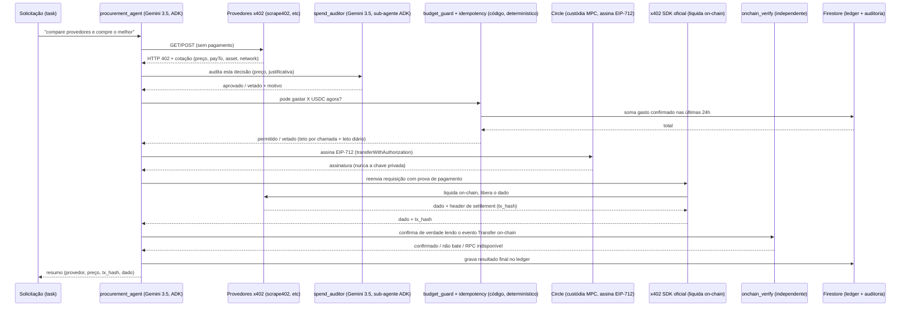

# Arquitetura

## Por que cada peça existe

- **`spend_auditor` como sub-agente ADK, não uma chamada solta**: separa
  quem decide (agente principal) de quem audita (auditor), com contrato
  de saída estruturado (`AuditVerdict`). Testável e substituível
  independente do resto.

- **`budget_guard` roda DEPOIS da auditoria e pode vetar mesmo com
  aprovação**: os dois modelos de LLM podem concordar e ainda assim
  estar errados (alucinação, prompt injection do provedor, etc). O teto
  é matemática determinística sobre o ledger real, não outra opinião de
  LLM.

- **Assinatura via Circle (MPC), não chave privada no processo**: o
  agente nunca tem acesso a uma chave capaz de mover fundos além do que
  a Circle autoriza via API. Mesmo padrão de custódia não-custodiada
  usado no projeto anterior (AgentPay), agora aplicado ao protocolo
  x402 "exact" real (EIP-3009) em vez de um transfer direto caseiro.

- **`onchain_verify` é independente do `x402` SDK**: o SDK oficial
  liquida o pagamento e devolve um header de settlement — mas nós lemos
  o evento `Transfer` direto da rede, com nosso próprio parsing, antes
  de marcar qualquer coisa como confirmada. Se o facilitator mentir ou
  falhar parcialmente, isso não vira verdade automaticamente pro nosso
  ledger.

- **Firestore em vez de SQLite local**: o Cloud Run é stateless — cada
  instância nova começa com filesystem vazio. O ledger precisa
  sobreviver entre execuções e escalar horizontalmente.

## Categorias de erro tratadas explicitamente

| Situação | Tratamento |
|---|---|
| RPC caiu durante a verificação, mas o pagamento já foi liquidado | `RpcUnavailableError` — fica `PENDING_VERIFY`, nunca reenvia pagamento |
| Recibo on-chain não bate com o esperado | `VerificationMismatchError` — marca como falho, não reconcilia sozinho |
| Mesmo pagamento (provedor+valor+escopo) tentado 2x | `idempotency.is_duplicate` bloqueia antes de qualquer chamada de pagamento |
| Orçamento diário ou por chamada estourado | `budget_guard` veta antes de qualquer chamada de pagamento |
| Credenciais da Circle ausentes | Erro claro e acionável (`MissingCircleCredentialsError`), não uma exceção genérica |
